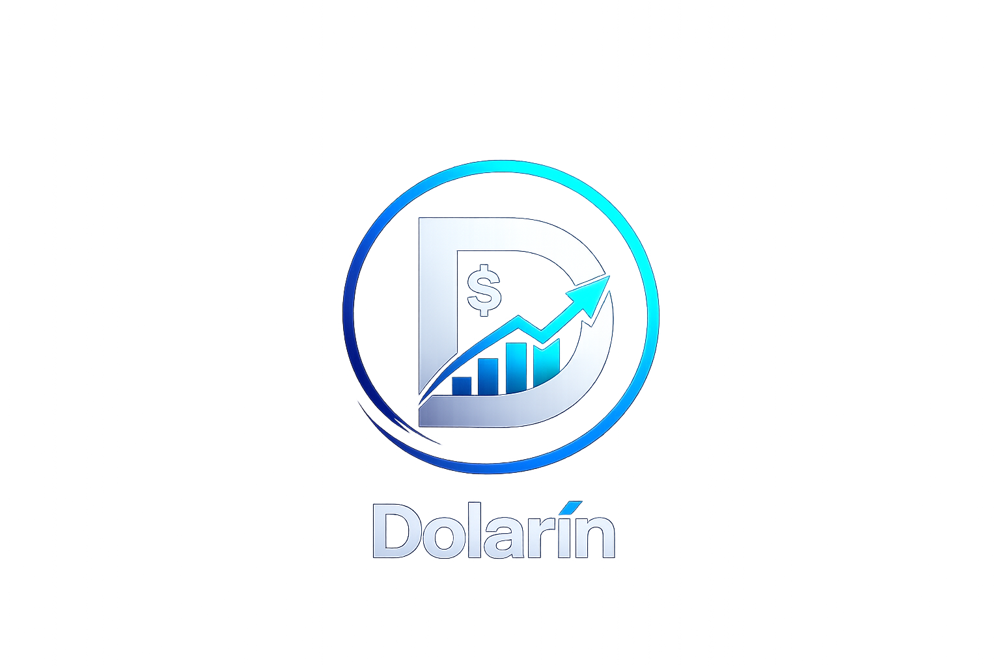

# 💵 Dolarín

<p align="center">



</p>


<h3 align="center">
Tipo de cambio y mercados digitales de Bolivia
</h3>


<p align="center">

Información cambiaria, referencias USDT P2P
y herramientas digitales para usuarios bolivianos.

</p>


---

# 📌 Sobre Dolarín

**Dolarín** es una aplicación creada para facilitar
el acceso a información del mercado cambiario en Bolivia.

Su objetivo es reunir en un solo lugar:

- Tipo de cambio referencial.
- Precios USDT P2P.
- Comparación de mercados digitales.
- Tendencias del mercado.
- Información útil para usuarios bolivianos.


Dolarín no realiza operaciones financieras,
no compra ni vende monedas digitales y no funciona
como intermediario entre usuarios.

---

# 🚀 Características


## 💱 Tipo de cambio

Consulta referencias del valor del dólar
y otros activos digitales.


## 🔄 Mercado P2P

Información de plataformas digitales como:

- Binance P2P
- Bybit
- Eldorado
- Otros proveedores


## 📊 Seguimiento

Visualización de cambios y tendencias
del mercado.


## 🌙 Diseño moderno

Interfaz basada en:

- Material Design 3
- Diseño oscuro premium
- Responsive para móviles y escritorio


---

# 🛠️ Tecnologías utilizadas


## Frontend Web

- HTML5
- CSS3
- JavaScript
- Google Material Icons
- Google Fonts


## Próximamente

Integración con:

- APIs de mercados P2P
- Servicios financieros digitales
- Sistemas de análisis de datos


---

# 📂 Estructura del proyecto


```
Dolarin/

│
├── index.html
├── style.css
├── app.js
│
├── privacy.html
├── terms.html
│
├── README.md
│
└── assets/
    │
    ├── logo.png
    ├── favicon.png
    ├── app-preview.png
    ├── binance.png
    ├── bybit.png
    └── eldorado.png

```


---

# 💻 Instalación local


Clonar el repositorio:


```bash
git clone https://github.com/portacris/dolarin.git
```


Ingresar a la carpeta:


```bash
cd dolarin
```


Abrir:

```
index.html
```


También puedes utilizar un servidor local como:

- Visual Studio Code Live Server
- XAMPP
- Laragon
- Servidor web local


---

# 🌐 Publicación GitHub Pages


Para publicar:


1. Entrar al repositorio.


2. Ir a:

```
Settings
```

3. Seleccionar:

```
Pages
```


4. Elegir:


```
Deploy from branch
```


5. Seleccionar:


```
main
```


Después GitHub generará:


```
https://portacris.github.io/dolarin/
```


---

# 🔒 Privacidad


Documentos legales:


- Política de privacidad:

```
privacy.html
```


- Términos y condiciones:

```
terms.html
```


---

# 🎨 Identidad visual


Dolarín utiliza una identidad basada en:


- Tecnología financiera.
- Confianza.
- Mercado digital.
- Bolivia.


Paleta principal:


```
Fondo:
#0f172a


Azul:
#2563eb


Verde:
#22c55e


Texto:
#f8fafc

```


---

# 📱 Aplicación móvil


Dolarín será publicada próximamente
en Google Play.


La aplicación estará enfocada en:

- Información cambiaria.
- Mercado digital boliviano.
- Comparación de precios.
- Herramientas financieras informativas.


---

# 🤝 Contribuciones


Las sugerencias y mejoras son bienvenidas.


Si deseas colaborar:

1. Realiza un fork.
2. Crea una rama.
3. Envía tus cambios.


---

# 📄 Licencia


Este proyecto está protegido por derechos
de autor.


El uso, modificación o distribución comercial
requiere autorización.


---

# 📬 Contacto


Proyecto:

**Dolarín**


Repositorio:

```
https://github.com/portacris/dolarin
```


Página oficial:


```
https://portacris.github.io/dolarin/
```


---

<p align="center">

💵 Dolarín  
El mercado cambiario de Bolivia en un solo lugar.

</p>
